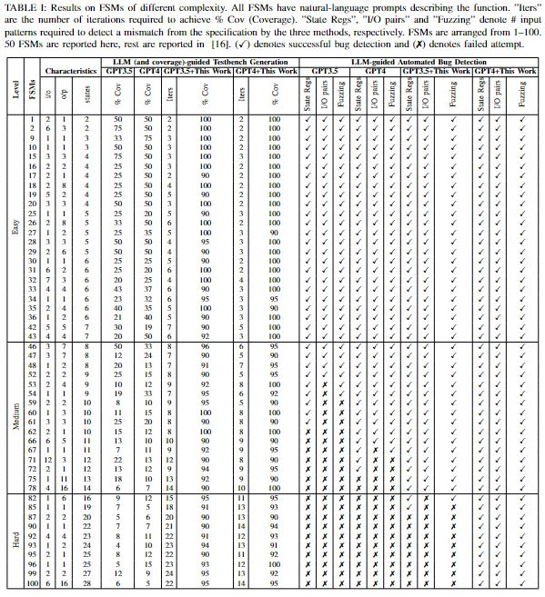
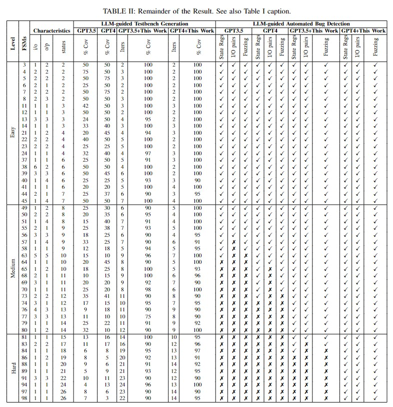

# This is GitHub repo for our project on LLM Hardware Security.

## Setup:

### Prerequisites

- Python 3.6 or newer
- `pip` for installing dependencies

### Installation

1.  Clone the repository to your local machine:
```sh
git clone https://github.com/jitendra-bhandari/LLM-Aided-Testbench-Generation-for-FSM.git 
cd LLM-Aided-Testbench-Generation-for-FSM
```
2.  Set up a virtual environment (optional but recommended):
```sh
python3 -m venv venv
source venv/bin/activate
```
3.  Install the required python packages:
```sh
pip3 install -r requirements.txt
pip3 install -r requirements_new.txt
```

### Environment Variables
API Keys (Must be set for the models being used):
 - OpenAI API Key: `OPENAI_API_KEY` 
 - Anthropic API Key: `ANTHROPIC_API_KEY`
 - PaLM API Key: `PALM_API_KEY`

## Usage
To use the tool, follow the steps below:

1. Prepare your initial Verilog design prompt.

2. Run the tool with the necessary arguments:
```sh
python testbench_generation.py FSM1/2012_q2b.v --api_key [XXXX]
```
### Arguments
 - `-h|--help`: Prints this usage message
 - `-p|--prompt`: The initial design prompt for the Verilog module
 - `-m|--model`: The LLM to use for Verilog generation. Must be one of the following:
    - ChatGPT3p5
    - ChatGPT4
    - Claude
    - PaLM
    - CodeLLama
 - `-id|--model_id`: [Optional] for model other than CodeLLama, for codellama, model id is the huggingface repository to codellama
 - `-o|--outdir`: [Optional] Directory to output files to
 - `-l|--log`: [Optional] File to log the outputs of the model




## Citing LLM-Aided Testbench Generation

If you use this in your research or project, please cite it using the following BibTeX entry:

```bibtex
@misc{bhandari2024llmaidedtestbenchgenerationbug,
      title={LLM-Aided Testbench Generation and Bug Detection for Finite-State Machines}, 
      author={Jitendra Bhandari and Johann Knechtel and Ramesh Narayanaswamy and Siddharth Garg and Ramesh Karri},
      year={2024},
      eprint={2406.17132},
      archivePrefix={arXiv},
      primaryClass={cs.AR},
      url={https://arxiv.org/abs/2406.17132}, 
}
